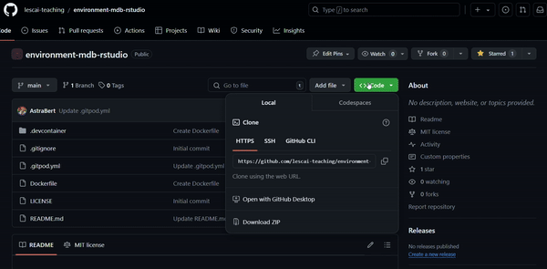
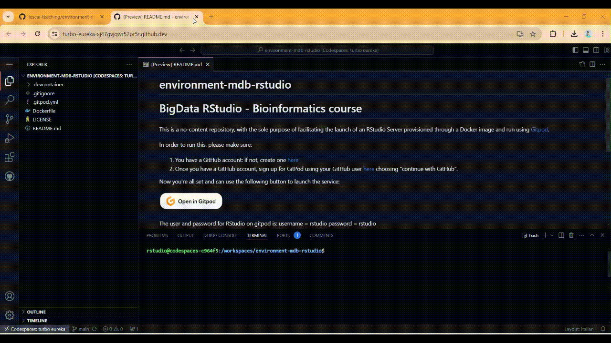
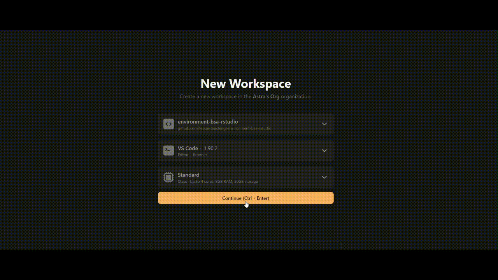

# RStudio - Bioinformatics course

This is a no-content repository, with the sole purpose of facilitating the launch of an RStudio Server provisioned through a Docker image and run using either [GitHub CodeSpaces](https://docs.github.com/en/codespaces/overview) or [Gitpod](https://www.gitpod.io/docs/introduction).

## GitHub CodeSpaces

### 1. Pre-requirements

In order to make the CodeSpace work, you should have a GitHub account: if you don't have one, sign up to GitHub [here](https://github.com/signup).

### 2. Launch the Space

Click the  `<> Code` button on the top right, selecting `Codespaces` and then `Create codespace on main`, as you can see in the animation here:

### 3. Open in JupyterLab

Once the space has been created, to make it work properly you should:

1. Shut it down
2. Go back to the repository page
3. Click the  `<> Code` button on the top right, selecting `Codespaces`
4. Select the space you have just created, click on `...` and then on `Open in JupyterLab`

And you're done! A JupyterLab interface should open soon, from which you'll be able to click on the `RStudio` icon and start working with RStudio😁. See the video down here:

## GitPod Workspaces

### 1. Pre-requirements
In order to run this space with GitPod, please make sure:

1. You have a GitHub account: if not, create one [here](https://github.com/signup)
2. Once you have a GitHub account, sign up for GitPod using your GitHub user [here](https://gitpod.io/login/) choosing "continue with GitHub".

As a last thing, ensure that pop-ups are allowed on your browser.

### 2. Launch the workspace in GitPod

Now you're all set and can use the following button to launch the service.

Just click on "Continue (ctrl + enter)" to go on with the workspace set up.

Once the space has been loaded, you may be asked to allow the opening of a new window with RStudio: allow the opening.

You'll be also prompted to sign in to RStudio, and you should use the following credentials:

- **username**: gitpod
- **password**: rstudio

Watch the demo here for reference:

